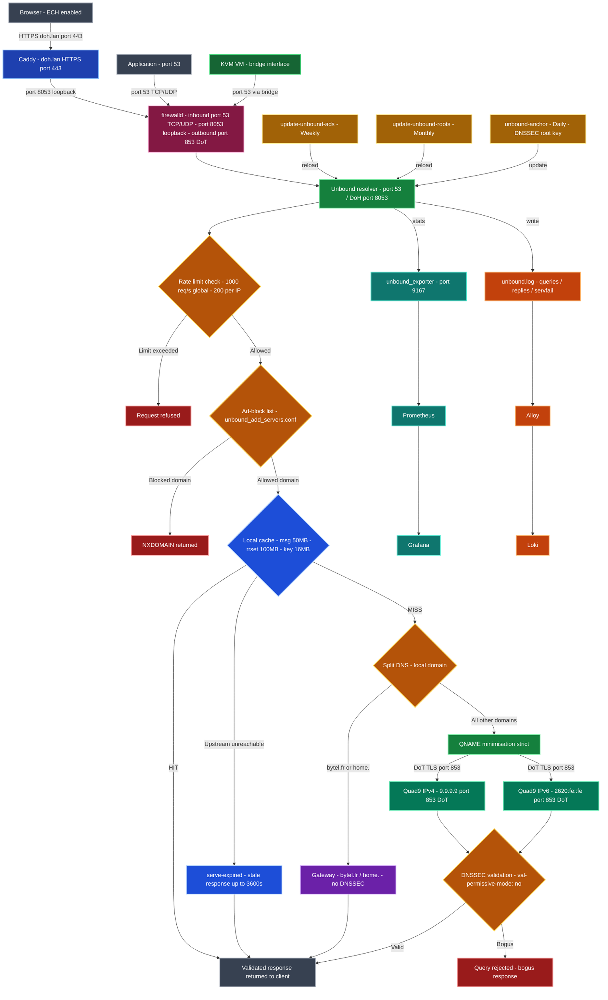

# unbound-tumbleweed-config


Production-ready Unbound recursive DNS resolver configuration for **openSUSE Tumbleweed** — hardened, privacy-first, with DNS-over-TLS upstream (Quad9), local DoH endpoint, DNSSEC validation, ad blocking, and automated maintenance via systemd.

---

## Overview

This configuration transforms Unbound into a full privacy DNS stack serving the local host and KVM virtual machines. Upstream resolution is exclusively performed over **TLS (DoT)** to Quad9 — no plaintext DNS leaves the system.

Key design goals:
- **Privacy** — QNAME minimization, hidden identity/version, no upstream query logging
- **Security** — DNSSEC validation, hardened against amplification and rebinding attacks
- **Local DoH** — serves DNS-over-HTTPS internally via Caddy (`doh.lan`) for ECH-capable browsers
- **Ad blocking** — ~3500 domains blocked at DNS level via pgl.yoyo.org (Unbound format)
- **Automation** — systemd timers maintain the ad list (weekly) and root hints (monthly)
- **Monitoring** — statistics exported to Prometheus via unbound_exporter

---

## Architecture — DNS Privacy Stack

The diagram below shows how a DNS query travels through the full stack, what decisions are made at each step, and which protocols are used.



> **Reading the diagram:** A DNS query enters from the top (classic `:53` or DoH via Caddy).  
> Unbound first checks the ad-block list (→ instant NXDOMAIN if matched), then validates DNSSEC,  
> checks the local cache, and only sends upstream over **encrypted DoT** if the answer is not cached.  
> No plaintext DNS query ever leaves the system.

---

## System requirements

| Component | Version |
|-----------|---------|
| Unbound | 1.x |
| openSUSE | Tumbleweed (rolling) |
| Threads | 4 (adjust to CPU core count) |
| RAM | ~170 MB (`msg-cache 50m` + `rrset-cache 100m` + overhead) |

---

## Features

### Privacy & security

| Setting | Effect |
|---------|--------|
| `qname-minimisation: yes` | Minimizes query exposure to authoritative servers |
| `hide-identity` / `hide-version` | No resolver fingerprinting |
| `use-caps-for-id: yes` | 0x20 encoding to detect forged responses |
| `deny-any: yes` | Blocks ANY queries used for DNS amplification |
| `aggressive-nsec: yes` | DNSSEC negative caching, reduces upstream load |
| `private-address` (all RFC1918) | Full DNS rebinding protection |
| `ratelimit: 1000` / `ip-ratelimit: 200` | Flood protection (host + VMs) |

### DNSSEC
- Full validation via `module-config: "validator iterator"`
- Auto-managed trust anchor: `/var/lib/unbound/root.key`
- `val-permissive-mode: no` — strict mode, bogus responses are rejected

### DNS-over-TLS upstream

| Server | Address | Port |
|--------|---------|------|
| Quad9 (IPv4) | `9.9.9.9` | 853 |
| Quad9 (IPv4) | `149.112.112.112` | 853 |
| Quad9 (IPv6) | `2620:fe::fe` | 853 |
| Quad9 (IPv6) | `2620:fe::9` | 853 |

TLS certificate verified against `/etc/ssl/ca-bundle.pem` (openSUSE system trust store).  
Cipher policy: `PROFILE=SYSTEM` aligned to openSUSE hardening.

### Local DoH endpoint
- Unbound listens on `127.0.0.1@8053` / `::1@8053` (HTTP, no TLS downstream)
- Caddy terminates HTTPS and proxies to Unbound, resolves as `doh.lan`
- Enables ECH in LibreWolf and Chromium using a locally trusted resolver

### Ad blocking
- Domain list from [pgl.yoyo.org](https://pgl.yoyo.org/adservers/) in Unbound format
- Deployed to `local.d/unbound_add_servers.conf`
- Updated weekly via systemd — see [`systemd-units/`](systemd-units/)

### Performance

| Setting | Value | Effect |
|---------|-------|--------|
| `msg-cache-size` | 50 MB | Query response cache |
| `rrset-cache-size` | 100 MB | Resource record cache |
| `num-threads` | 4 | Parallel query processing |
| `prefetch: yes` | — | Pre-fetches expiring records |
| `serve-expired: yes` | 3600s | Serves stale cache under TTL |
| `edns-tcp-keepalive` | yes | Persistent TLS connections to Quad9 |

---

## Repository structure

```
unbound-tumbleweed-config/
├── unbound.conf              # Main configuration (production)
├── local.d/
│   ├── README.md             # Documents each fragment
│   └── doh-local.conf        # Local zone for doh.lan
├── systemd-units/
│   ├── update-unbound-ads.service    # Weekly ad list update
│   ├── update-unbound-ads.timer
│   ├── update-unbound-roots.service  # Monthly root hints update
│   └── update-unbound-roots.timer
├── CHANGELOG.md
└── LICENSE
```

---

## Installation

### 1. Install Unbound

```bash
sudo zypper install unbound
```

### 2. Deploy configuration

```bash
sudo cp unbound.conf /etc/unbound/unbound.conf
```

Edit the following placeholders in `unbound.conf` to match your network:

| Placeholder | Replace with |
|-------------|-------------|
| `YOUR_BRIDGE_INTERFACE` | KVM bridge interface (e.g. `br0`) |
| `YOUR_LAN_SUBNET` | Local network (e.g. `192.168.1.0/24`) |
| `YOUR_GATEWAY_IP` | Router IP (e.g. `192.168.1.254`) |

### 3. Deploy local.d fragments

```bash
sudo mkdir -p /etc/unbound/local.d
sudo cp local.d/doh-local.conf /etc/unbound/local.d/
```

### 4. Generate control keys and initialize DNSSEC

```bash
sudo unbound-control-setup
sudo unbound-anchor -a /var/lib/unbound/root.key
```

### 5. Deploy systemd units

```bash
sudo cp systemd-units/*.service /etc/systemd/system/
sudo cp systemd-units/*.timer /etc/systemd/system/
sudo systemctl daemon-reload

sudo systemctl enable --now update-unbound-ads.timer
sudo systemctl enable --now update-unbound-roots.timer

# Populate immediately on first install
sudo systemctl start update-unbound-ads.service
sudo systemctl start update-unbound-roots.service
```

### 6. Start Unbound

```bash
sudo systemctl enable --now unbound
```

---

## Automated maintenance

| Unit | Trigger | Action |
|------|---------|--------|
| `update-unbound-ads.timer` | Weekly + up to 1h random delay | Downloads pgl.yoyo.org list, reloads Unbound |
| `update-unbound-roots.timer` | Monthly + up to 1h random delay | Downloads root hints from internic.net, reloads Unbound |
| `unbound-anchor.timer` | Daily (built-in) | Updates DNSSEC root trust anchor |

All timers use `Persistent=true` — missed runs execute at next boot.

---

## Useful commands

```bash
# Reload configuration without restart
sudo unbound-control reload

# Test resolution and DNSSEC
dig example.com @127.0.0.1
dig sigok.verteiltesysteme.net @127.0.0.1 +dnssec

# Test ad blocking (should return NXDOMAIN)
dig doubleclick.net @127.0.0.1

# Check statistics
sudo unbound-control stats_noreset | head -20

# Monitor DNS queries live
sudo tail -f /var/log/unbound.log
```

---

## Integration

| Component | Role |
|-----------|------|
| [squid-tumbleweed-config](https://github.com/crisis1er/squid-tumbleweed-config) | Squid proxy uses Unbound as DNS resolver (`dns_nameservers 127.0.0.1 ::1`) |
| Caddy | Terminates HTTPS for `doh.lan`, proxies to Unbound port 8053 |
| Prometheus + unbound_exporter | Exposes resolver statistics for monitoring |

---

## Contributing

Issues and pull requests are welcome.  
Please include your Unbound version (`unbound -V`) and openSUSE version in bug reports.

---

## License

MIT License — see [LICENSE](LICENSE) for details.
